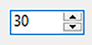
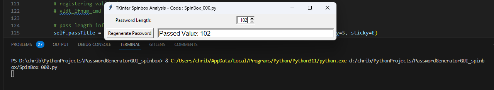
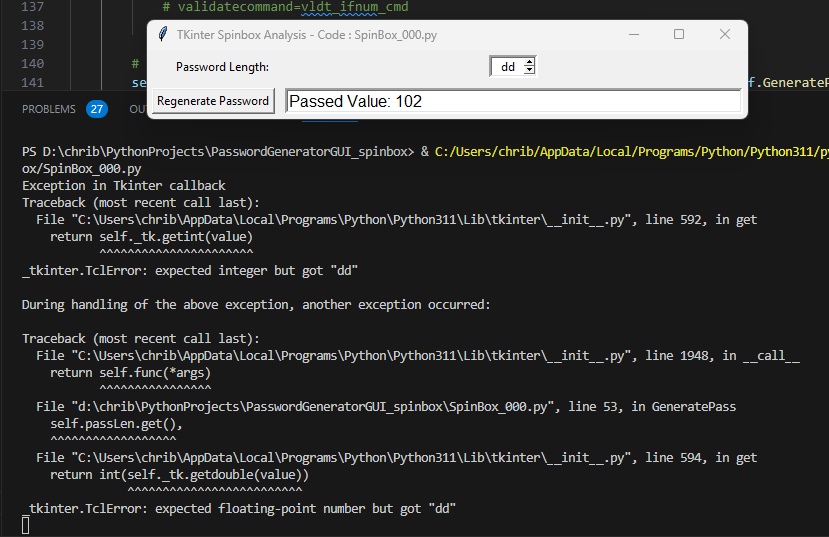

# Analysis of the Python TKinter Spinbox control

This repository borrows the code repository [Password Generator GUI written in Python using the TKinter module](https://github.com/chribonn/PasswordGeneratorPython). It explains how one can programmatically make the Spinbox control function correctly with a numeric range both visually and operationally.  It also opens a discussion on this control to make it more efficient.

This article and the source code can be downloaded from: [Github](https://github.com/chribonn/TKinter_Spinbox)

## TKinter's Spinbox control

The Spinbox control ["*is an Entry with increment and decrement arrows. It is commonly used for number entry or to select from a list of string values*"](https://tkdocs.com/pyref/ttk_spinbox.html). The control accepts input through the up or down arrows or by typing directly into the text box.

While the control has built in functionality that allows range checking when the up and down arrows are pressed, the same is missing when one types directly into the text box. This means that one can type anything into a Spinbox.

This article describes this limitation and explains how it can be addressed.

## The Solution

This repository comes with two Python programs:

* Spinbox_000.py - This code demonstrates the Spinbox control with no supporting code.
* Spinbox_001.py - This additional code to make the Spinbox control operate as defined by its parameters and also causes the text box to only display appropriate values.

The Spinbox core settings relevant to this discussion are:

        self.passLenSb = Spinbox(
            textvariable=self.passLen, 
            from_=1, 
            to=100, 
            increment=1,

* self.passLenSb is the name of the control.
* textvariable references the variable that stores the value in the Spinbox. One reads or updates the value fo the control through the references variable (textvariable in this example).
* from_, to and increment let one specify the range and incremental value the control will change by when the arrows are pressed.
* The control also allows for the parameter values. This is not discussed here.

Spinbox_000.py, allows one to enter values outside the from_ and to or a number that would not be a correct increment counting from from_.

With Spinbox_000.py one could also enter something that is not of the same data type as the control expects.

## Spinbox_001.py

*This is not a deep dive into all the parameters of the Spinbox control. Read the documentation for that.* It simply explains how the desired functionality was achieved. Refer to [Tcl8.6.13/Tk8.6.13 Documentation > Tk Commands > spinbox](https://tcl.tk/man/tcl8.6/TkCmd/spinbox.htm) for a more in-depth reference.

        ##### Start: commented out in Spinbox_000.py
        self.root.bind('<Return>', self.reset_focus)
        self.root.bind('<Tab>', self.reset_focus)
        
        # registering validation handler
        vldt_ifnum_cmd = (self.root.register(self.ValidateIfNum),'%P', '%W')
        ##### End: commented out in Spinbox_000.py
        .
        .
        .
        self.passLenSb = Spinbox(
            textvariable=self.passLen, 
            from_=1, 
            to=100, 
            increment=1,
             
            ##### Start: commented out in Spinbox_000.py
            validate='focus', 
            validatecommand=vldt_ifnum_cmd,
            ##### End: commented out in Spinbox_000.py

The validate parameter specifies what triggers validation. In this solution this will happen whenever the control gains or loses focus. validatecommand points to the code that is executed. 

OOTB typing in a value in the Spinbox control and pressing Enter or Tab would not trigger a focus change so these two keys had to be programed to call the function reset_focus whenever the were pressed.

    
    ##### Start: commented out in Spinbox_000.py
    def spinbox_valid(self, widget_name):
        """Returns whether the contents of the spinbox are valid

        Args:
            widget_name (str): the internal Tcl name of the spinbox

        Returns:
            boolean: contents are valid
        """
        try:
            user_input = self.passLen.get()
            valid = isinstance(user_input, int)
        except:
            valid = False
        # now that we've ensured the input is only integers, range checking!
        if valid:
            # get minimum and maximum values of the widget to be validated
            minval = int(self.root.nametowidget(widget_name).config('from')[4])
            maxval = int(self.root.nametowidget(widget_name).config('to')[4])
            # check if it's in range
            if int(user_input) not in range (minval, maxval):
                valid = False
        return valid
    ##### End: commented out in Spinbox_000.py

    ##### Start: commented out in Spinbox_000.py
    def ValidateIfNum(self, user_input, widget_name):
        """
        Args:
            user_input (str): The value typed into the spinbox
            widget_name (str): The widget name

        Returns:
            boolean: Whether the value is valid
        """
        valid = self.spinbox_valid(widget_name)
        if valid:
            self.last_valid_passLen = int(self.passLen.get())
            
        return valid
    ##### End: commented out in Spinbox_000.py

    ##### Start: commented out in Spinbox_000.py
    def reset_focus(self, event):
        """Validates whether the number is valid.  If it isn't it resets the value

        Args:
            event (event): Event being captured

        Returns:
            boolean: was spinbox content valid
        """
        
        valid = self.spinbox_valid('!spinbox')
        
        if not valid:
            self.passLen.set(self.last_valid_passLen)

        self.root.focus()
        return valid
    ##### End: commented out in Spinbox_000.py

What reset_focus and ValidateIfNum function do is to read what is in the spinbox control (using get), validating it and wither keeping the value if it is correct or replacing it with the last valid value.

The video below demonstrates the control handling Tab and Enter keys.

<video src="Assets/SpinBox_001_000 _TAB_Enter.mp4" controls="controls" style="max-width: 730px;">
</video>

The video below demonstrates the control handling type and range checks.

<video src="Assets/SpinBox_001_001_Type_Range.mp4" controls="controls" style="max-width: 730px;">
</video>

## Conclusion

The Spinbox control is able to cycle through the possible values automatically when the up and down buttons are pressed. So why not create a tuple of possible values when the control is initialized and check that the entered value exists in the tuple?  If not reject the input and restore what was there before?

Another improvement to this control would be to allow the actual textbox to be set to readonly. In this scenario only the up and down buttons would be accessible.

Anyone who has developed solutions that need to cater for a large number of developers has to think about flexibility, but when 99% of the use cases are similar to the ones described here would it not be more efficient to have this functionality on by default and allow those 1% to have to type in a few lines of code for their niche needs?

